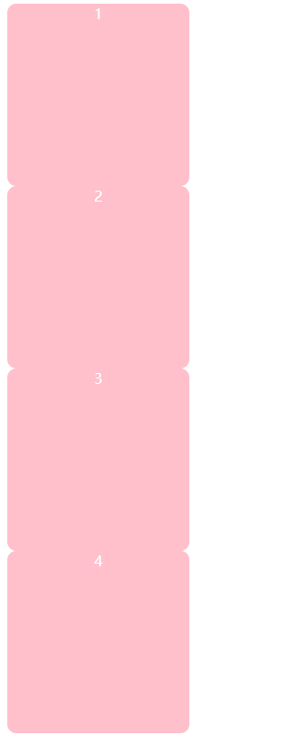

### CSS是什么？

CSS：**Cascading Style Sheet** 层叠样式表。

是一组样式设置的规则，用于控制页面的外观样式。

**层叠样式表**（Cascading Style Sheets，缩写为 **CSS**）是一种**样式表**语言，用来描述 HTML 文档的呈现方式。CSS 描述了在屏幕、纸质、音频等其他媒体上的元素应该如何被渲染的问题。

### 为什么使用CSS？

- 实现内容与样式的分离，便于团队开发
- 样式复用，便于网站的后期维护
- 页面的精确控制，让页面更精美

### CSS引入方式

##### 1.行内式CSS

```html
<div style="width: 500px;height: 500px;background-color: pink;border-radius: 10px;color: white;text-align: center;">1</div>
```

行内式CSS就是给标签添加 style属性，然后设置相应的样式。


缺点: 样式写在标签当中，标签和样式的耦合度过高，标签过于拥挤。

思考: style 是标签的一个？

<hr>


##### 2.内联式CSS

在html页面当中的style标签当中设置css样式

```html
<!DOCTYPE html>
<html lang="en">
    <head>
        <meta charset="UTF-8">
        <meta name="viewport" content="width=device-width, initial-scale=1.0">
        <title>Document</title>
        <style>
            div {
                width: 500px;
                height: 500px;
                background-color: pink;
                border-radius: 10px;
                color: white;
                border-radius: 10px;
                text-align: center;
            }
        </style>
    </head>
    <body>
        <div>1</div>
    </body>
</html>
```


**语法: 选择器 {  样式声明: 值  }**

优点: 解决了标签和样式耦合度过高的问题。

缺点:但css样式代码依然和html耦合度过高。

<hr>


##### 3.外联式CSS

把css样式代码单独抽离为一个文件，通过link标签引入对应html页面。


```css
/* css文件当中 */
div {
    width: 500px;
    height: 500px;
    background-color: pink;
    border-radius: 10px;
    color: white;
    border-radius: 10px;
    text-align: center;
}
```

```html
<!-- html页面当中 -->
<!DOCTYPE html>
<html lang="en">
    <head>
        <meta charset="UTF-8">
        <meta name="viewport" content="width=device-width, initial-scale=1.0">
        <title>Document</title>
        <link rel="stylesheet" href="test.css">
    </head>
    <body>
        <div>1</div>
    </body>
</html>
```


注意: 在css文件当中，不能出现标签以及其他代码了。

优点:真正实现了样式与标签的解耦。


### 基础选择器

##### 1.标签选择器

说明: 选中页面上所有同种标签,并设置样式

```html
<!DOCTYPE html>
<html lang="en">
    <head>
        <meta charset="UTF-8">
        <meta name="viewport" content="width=device-width, initial-scale=1.0">
        <title>Document</title>
        <style>
            div {
                width: 200px;
                height: 200px;
                background-color: pink;
                border-radius: 10px;
                color: white;
                text-align: center;
            }
        </style>
    </head>
    <body>
        <div>1</div>
        <div>2</div>
        <div>3</div>
        <div>4</div>
    </body>
</html>
```



<hr>


##### 2.通配符选择器

选中页面上所有的标签并且设置样式。

```html
<!DOCTYPE html>
<html lang="en">
    <head>
        <meta charset="UTF-8">
        <meta name="viewport" content="width=device-width, initial-scale=1.0">
        <title>Document</title>
        <style>
            *{
                width: 200px;
                height: 200px;
                background-color: pink;
                color: white;
            }
        </style>
    </head>
    <body>
        <div>1</div>
        <div>2</div>
        <div>3</div>
        <div>4</div>
    </body>
</html>
```


思考:为什么会出现这种情况？？

<hr>


##### 3.class类名选择器

通过给标签设置类名，再选中对应类名设置样式。


```html
<!DOCTYPE html>
<html lang="en">
    <head>
        <meta charset="UTF-8">
        <meta name="viewport" content="width=device-width, initial-scale=1.0">
        <title>Document</title>
        <style>
            .test {
                width: 200px;
                height: 200px;
                background-color: pink;
                border-radius: 10px;
                color: white;
                text-align: center;
            }
        </style>
    </head>
    <body>
        <div class="test">1</div>
        <div>2</div>
        <div>3</div>
        <div>4</div>
    </body>
</html>
```

语法: .类名 { 样式声明 }

**注意: 类名命名规范，类名以数字，字母，_，- 组成,但不能以数字开头。**

<hr>


##### 4.id选择器

通过给标签设置类名，再通过对应id名设置样式。


```html
<!DOCTYPE html>
<html lang="en">
    <head>
        <meta charset="UTF-8">
        <meta name="viewport" content="width=device-width, initial-scale=1.0">
        <title>Document</title>
        <style>
            #test_1 {
                width: 200px;
                height: 200px;
                background-color: pink;
                border-radius: 10px;
                color: white;
                text-align: center;
            }
        </style>
    </head>
    <body>
        <div id="test_1">1</div>
        <div>2</div>
        <div>3</div>
        <div>4</div>
    </body>
</html>

```

语法: .类名 { 样式声明 }

**注意: id名命名规范，类名以数字，字母，_，- 组成,但不能以数字开头。并且id名是唯一且不重复的**。

### 颜色

##### 前景色

`color`可以设置前景色，前景色在css当中更多的表现接近于字体颜色。

或者说 前景色==字体颜色


```html
<!DOCTYPE html>
<html lang="en">
  <head>
    <meta charset="UTF-8" />
    <meta name="viewport" content="width=device-width, initial-scale=1.0" />
    <title>Document</title>
    <style>
      p {
        color: red;
      }
    </style>
  </head>
  <body>
    <p>
      Split()方法一共有两个参数值可以填写数据，分别是separator和howmony，separator参数是必须的，可以写入字符串或者正则表达式，<br />
      从该参数指定的地方分割stringObject，第二个参数howmony则是可以选择是否填写数据，该参数客指定返回的数组的最大长度。
    </p>
  </body>
</html>
```

##### 背景色

`background-color`可用来给元素设置背景色


```html
<!DOCTYPE html>
<html lang="en">
    <head>
        <meta charset="UTF-8" />
        <meta name="viewport" content="width=device-width, initial-scale=1.0" />
        <title>Document</title>
        <style>
            div {
                color: red;
                background-color: skyblue;
            }
        </style>
    </head>
    <body>
        <div>
            Split()方法一共有两个参数值可以填写数据，分别是separator和howmony，separator参数是必须的，可以写入字符串或者正则表达式，<br />
            从该参数指定的地方分割stringObject，第二个参数howmony则是可以选择是否填写数据，该参数客指定返回的数组的最大长度。
        </div>
    </body>
</html>
```

