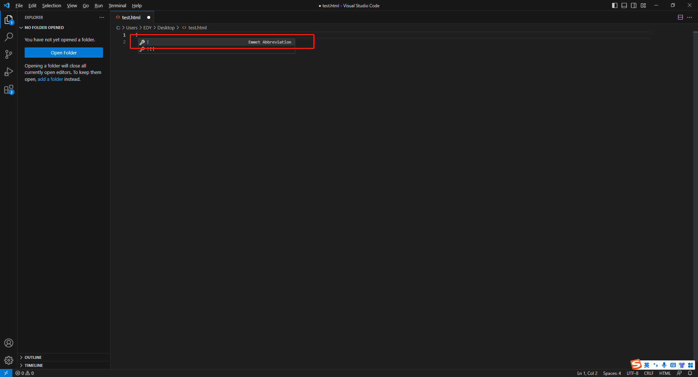
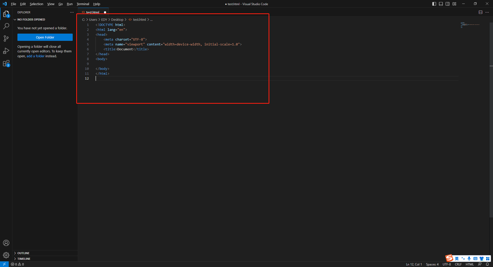
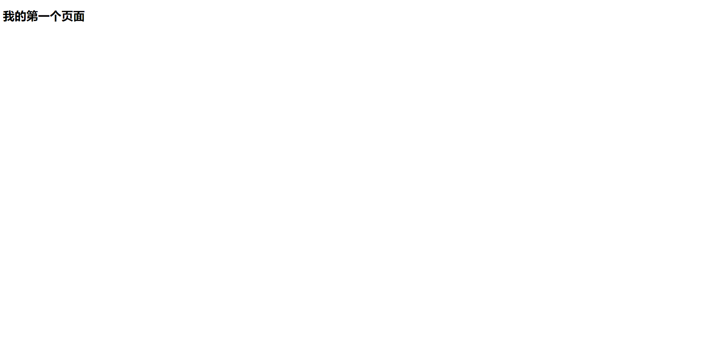
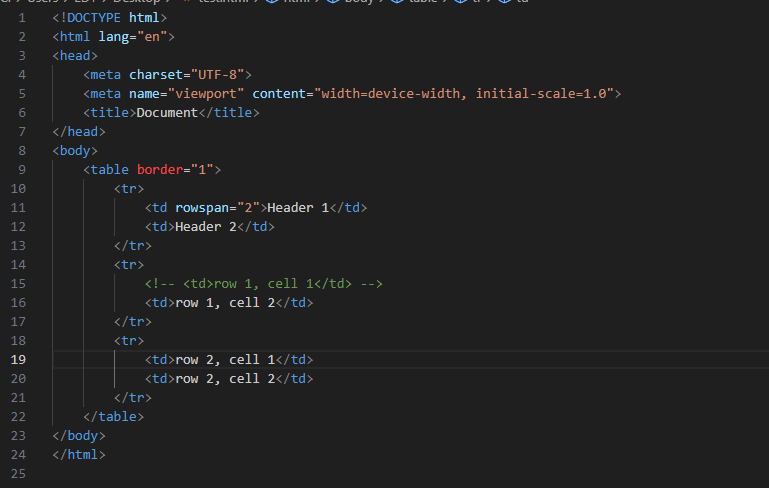
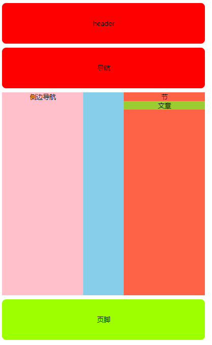
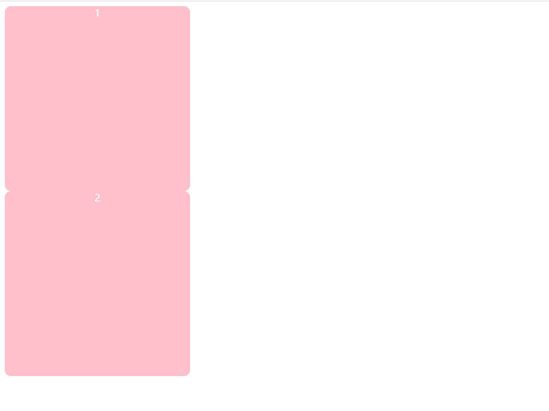
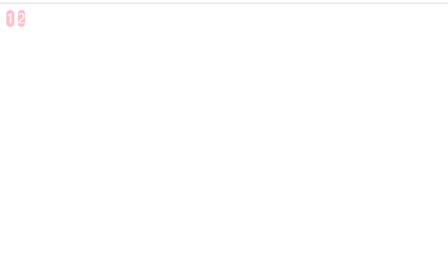
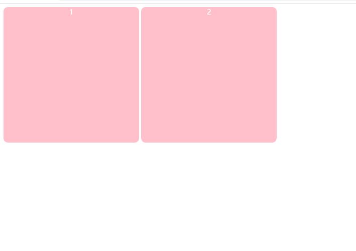

### 一.HTML是什么？

> HTML的全称为超文本标记语言(Hyper Text Markup Language)，是一种标记语言。它包括一系列标签，通过这些标签可以将网络上的文档格式统一，使分散的Internet资源连接为一个逻辑整体。HTML文本是由HTML命令组成的描述性文本，HTML命令可以说明文字，图形、动画、声音、表格、链接等。

```html
<title>我是一个标题</title>
预设
```

语法: <?></?> 或者 <? /> , 又称为双标签或者单标签。

- HTML 指的是超文本标记语言: **H**yper**T**ext **M**arkup **L**anguage
- HTML 不是一种编程语言，而是一种**标记**语言
- 标记语言是一套**标记标签** (markup tag)
- HTML 使用标记标签来**描述**网页
- HTML 文档包含了HTML **标签**及**文本**内容
- HTML文档也叫做 **web 页面**

思考:当我们在浏览器的url地址栏输入www.baidu.com的时候，会发生什么事情？

### 二.我的第一个网页

新建一个test.html文件，并在Visual Studio Code当中打开



按下回车，Visual Studio Code 会自动帮我们生成一个**完整的页面结构**



其中:

- `!DOCTYPE html`声明为 HTML5 文档 ,文档类声明
- `html` 元素是 HTML 页面的根元素
- `head` 元素包含了文档的元（meta）数据，如 <meta charset="utf-8"> 定义网页编码格式为 **utf-8（**由于在大部分浏览器中直接输出中文会出现乱码，所以要在头部将字符声明为UTF-8**）**
- `title`元素描述了文档的标题(网页的标题)
- `body` 元素包含了可见的页面内容

打开页面



### 三.标签

> 我们在页面上看到的，都是由一个个标签构成的，而想要在页面上展示出对应的样式，那么我们需要用到不同的标签。

##### 标题标签 

```html
<h1></h1> ~ <h6></h6> 分别表示 1级标题 ~ 6级标题
```

##### 段落标签

```html
HTML 段落是通过标签 <p> 来定义的
<p>这是一个段落</p>    

<p>
    你看这就是一个段落
</p>
```

##### 超链接

HTML 链接是通过标签 <a> 来定义的

```html
<a href="https://www.baidu.com">这是一个链接使用了 href 属性</a>
```

其中 href = "" ,这叫做标签的属性，标签的属性是**写在标签的内部**，每个标签都有自己的专有属性，但也有所有标签共同具有的 **全局属性**。

如: class ,id ....都是全局属性。

##### 图像标签

HTML 图像是通过标签  来定义的。**注意：** 图像的名称和尺寸是以属性的形式提供的。

```html

```

##### 表格标签

表格由 <table> 标签来定义。每个表格均有若干行（由 <tr> 标签定义），每行被分割为若干单元格（由 <td> 标签定义）。字母 td 指表格数据（table data），即数据单元格的内容。数据单元格可以包含文本、图片、列表、段落、表单、水平线、表格等等。

```html
<table border="1">
    <tr>
        <td>Header 1</td>
        <td>Header 2</td>
    </tr>
    <tr>
        <td>row 1, cell 1</td>
        <td>row 1, cell 2</td>
    </tr>
    <tr>
        <td>row 2, cell 1</td>
        <td>row 2, cell 2</td>
    </tr>
</table>
<--! tr代表行 ， td代表列 -->
```

##### 表格合并

跨行合并: 从上到下最上边的td，添加属性 **rowspan**,合并几个就写几，然后删除多余的tr

跨列合并:从左到右最左边的td，添加属性 **colspan**,合并几个就写几，然后删除多余的td



### 基本标签

```html
<h1>最大的标题</h1>
<h2> . . . </h2>
<h3> . . . </h3>
<h4> . . . </h4>
<h5> . . . </h5>
<h6>最小的标题</h6>
 
<p>这是一个段落。</p>
<br> （换行）
<hr> （水平线） horizontalrule
```

##### 文本格式化标签

```html
<b>粗体文本</b>
<em>强调文本</em>
<i>斜体文本</i>
<small>更小的文本</small>
<strong>重要的文本</strong>
 
<del> （删除的文本）
<ins> （插入的文本）
<sub> （下标文本）
<sup> （上标文本）
```

##### 列表标签

###### 无序列表

```html
<ul>
    <li>项目</li>
    <li>项目</li>
</ul>
```

###### 有序列表

```html
<ol>
    <li>第一项</li>
    <li>第二项</li>
</ol>
```

##### 表单标签

```html
<form action="demo_form.php" method="post/get">
    <input type="text" name="email" size="40" maxlength="50">
    <input type="password">
    <input type="checkbox" checked="checked">
    <input type="radio" checked="checked">
    <input type="submit" value="Send">
    <input type="reset">
    <input type="hidden">
    <select>
        <option>苹果</option>
        <option selected="selected">香蕉</option>
        <option>樱桃</option>
    </select>
    <textarea name="comment" rows="60" cols="20"></textarea>
</form>
```

##### HTML特殊字符

```html
&lt;   等同于 <
&gt;   等同于 >
&#169; 等同于 ©
&nbsp; 等同于 空格    
```

##### HTML5新增语义化标签

###### 什么叫语义化标签

那么什么叫做语义化呢，说的通俗点就是：明白每个标签的用途（在什么情况下我可以使用这个标签才合理）比如，网页上的文章的**标题**就可以用标题标签，网页上的各个栏目的**栏目名称**也可以使用标题标签。

文章中内容的段落就得放在**段落标签**中，在文章中有想强调的文本，就可以使用em标签表示强调等等。

###### 为什么要使用语义化标签

- 更容易被搜索引擎收录。
- 更容易让屏幕阅读器读出网页内容。
- 能够更好的体现页面的主题
- 兼容性更好，支持更多的网络设备



1.`<header>`头部标签

2.`<nav>`导航标签

3.`<main>`页面主体标签

4.`<section>`定义文档某个区域，节

5.`<aside>`侧边栏标签

6.`article`段落

6.`<footer>`尾部标签

**定义这些语义化标签的目的是为了简化代码，不需要整个网页都用div标签定义再class，可以直接写`<header></header>`。并且这些语义化标签可读性更强，看到这个标签就知道是哪个部分。**

> 注意：
>
> ①这种语义化标签主要是针对搜索引擎的
>
> ②这些新标签页面中可以使用多次

##### div标签

div意为divison，分割的意思，一般作为页面元素的容器使用

```html
<div>
    我是div
</div>
```

##### span标签

span标签一般也作为页面上元素的容器使用

```html
<span>我是span</span>
```

思考: 既然div和span都是作为页面元素的容器使用，那么他们有什么区别吗？

### 标签的分类

##### 性质划分

###### 块级元素(标签)

**div\p\li\ol\ul\dl\dd\dt\form\table\h1-h6**

> 1) 当块级标签没有设置宽度时，继承父级宽度 
>
> 2) 独占整一行 
>
> 3) 可以直接设置宽高



###### 行内元素(标签)

**a\span\i\b\strong\em**

> 1) 不继承父级宽度 
>
> 2) 不独占整一行
>
>  3) 不能设置宽高 
>
> 4) 宽高是由内容撑开的



###### 行内块元素(标签)

**img\input\textarea**

> 1) 不独占整一行
>
> 2) 可以直接设置宽高



**注意: 在使用标签的时候应该遵循，块元素作为容器，里面放其他元素，行内元素一般不作为容器使用。**