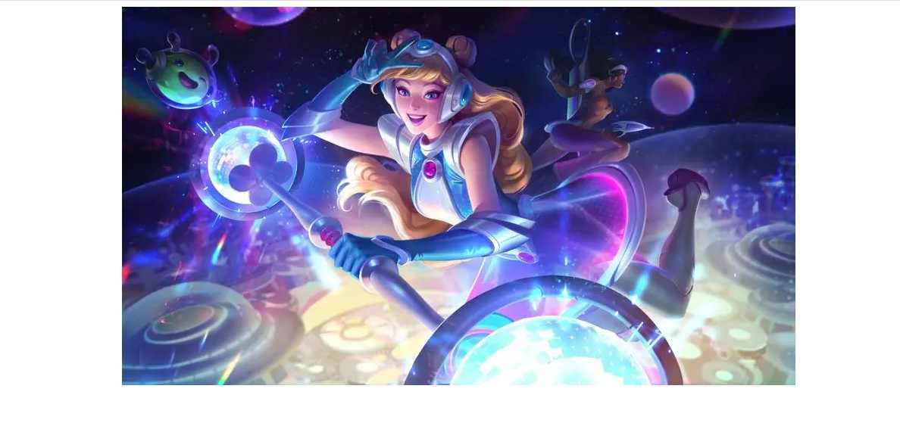
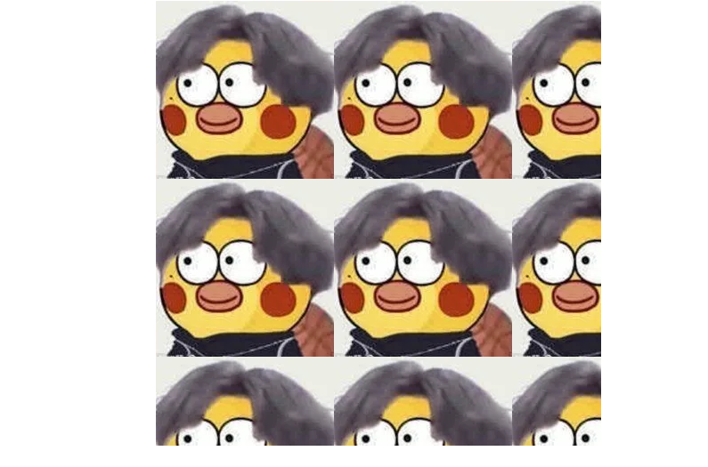
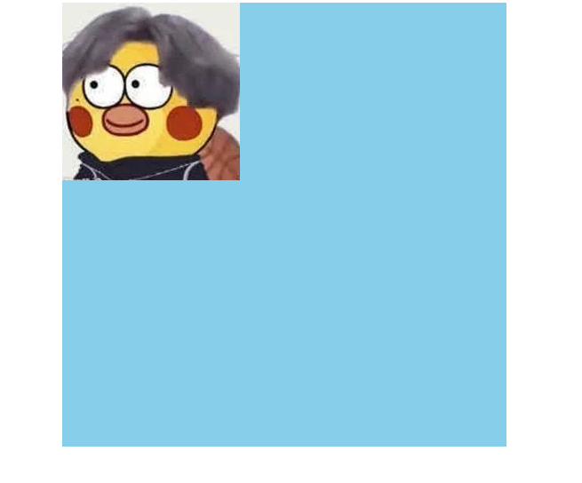
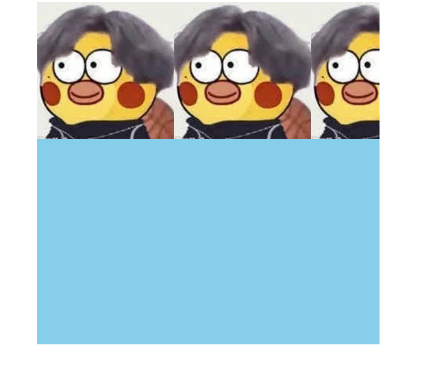
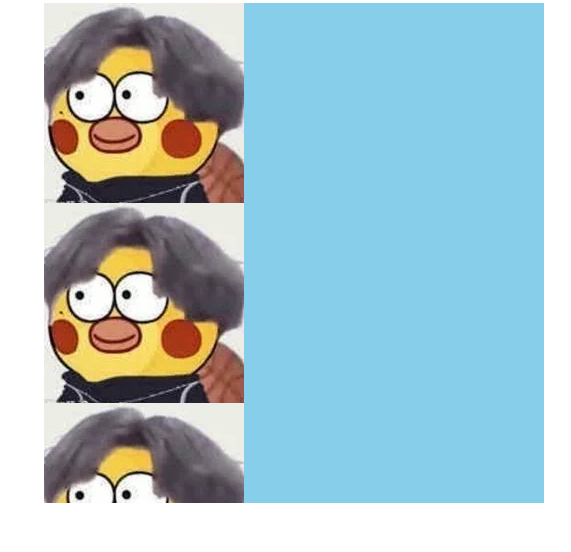
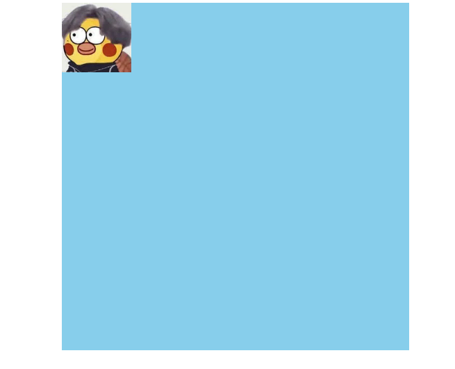
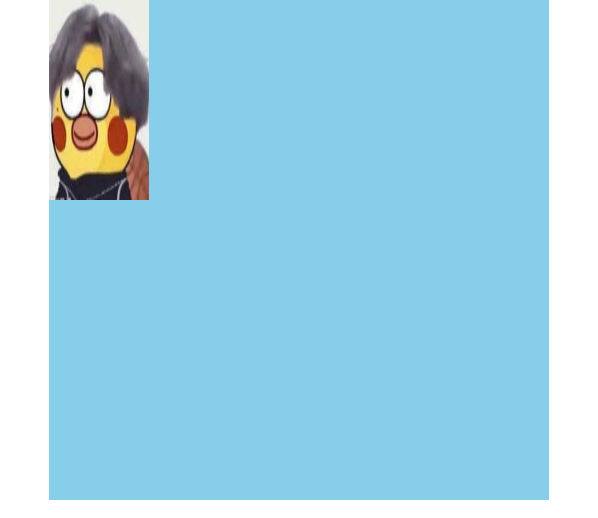
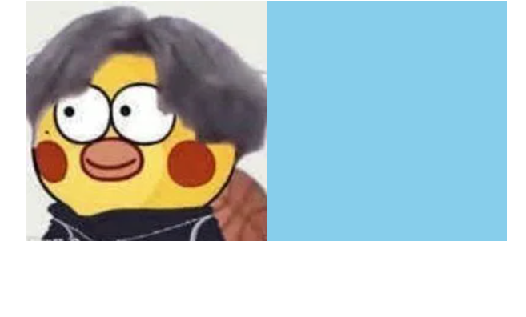

### CSS背景属性

> 通过 CSS 背景属性，可以给页面元素添加背景样式。 背景属性可以设置背景颜色、背景图片、背景平铺、背景图片位置、背景图像固定等

##### 背景颜色

> background-color 定义元素的背景颜色


```html
<!DOCTYPE html>
<html lang="en">
    <head>
        <meta charset="UTF-8" />
        <meta name="viewport" content="width=device-width, initial-scale=1.0" />
        <title>Document</title>
        <style>
            div {
                width: 200px;
                height: 200px;
                background-color: #0096ff;
            }
        </style>
    </head>
    <body>
        <div></div>
    </body>
</html>
```

**注意:background-color的默认值是transparent(透明)**

##### 背景图片

> background-image 定义元素的背景图片



```html
<!DOCTYPE html>
<html lang="en">
    <head>
        <meta charset="UTF-8" />
        <meta name="viewport" content="width=device-width, initial-scale=1.0" />
        <title>Document</title>
        <style>
            div {
                margin: 0 auto;
                width: 889px;
                height: 500px;
                background-image: url(https://img2.baidu.com/it/u=3329658017,1228637261&fm=253&fmt=auto&app=138&f=JPEG?w=889&h=500);
            }
        </style>
    </head>
    <body>
        <div></div>
    </body>
</html>
```

##### 背景重复

> background-repeat : repeat | no-repeat | repeat-x | repeat-y 

当背景图片不足以撑满元素时，背景图片默认会在x轴，y轴上进行重复。



###### no-repeat  设置不重复



```html
<!DOCTYPE html>
<html lang="en">
    <head>
        <meta charset="UTF-8" />
        <meta name="viewport" content="width=device-width, initial-scale=1.0" />
        <title>Document</title>
        <style>
            div {
                margin: 0 auto;
                width: 500px;
                height: 500px;
                background-image: url(https://img1.baidu.com/it/u=1078013792,1609133129&fm=253&fmt=auto&app=138&f=JPEG?w=200&h=200);
                background-repeat: no-repeat;
                background-color: skyblue;
            }
        </style>
    </head>
    <body>
        <div></div>
    </body>
</html>
```

###### repeat-x 仅在x轴重复



```html
<!DOCTYPE html>
<html lang="en">
    <head>
        <meta charset="UTF-8" />
        <meta name="viewport" content="width=device-width, initial-scale=1.0" />
        <title>Document</title>
        <style>
            div {
                margin: 0 auto;
                width: 500px;
                height: 500px;
                background-image: url(https://img1.baidu.com/it/u=1078013792,1609133129&fm=253&fmt=auto&app=138&f=JPEG?w=200&h=200);
                background-repeat: repeat-x;
                background-color: skyblue;
            }
        </style>
    </head>
    <body>
        <div></div>
    </body>
</html>
```

###### repeat-y 仅在y轴重复



```html
<!DOCTYPE html>
<html lang="en">
    <head>
        <meta charset="UTF-8" />
        <meta name="viewport" content="width=device-width, initial-scale=1.0" />
        <title>Document</title>
        <style>
            div {
                margin: 0 auto;
                width: 500px;
                height: 500px;
                background-image: url(https://img1.baidu.com/it/u=1078013792,1609133129&fm=253&fmt=auto&app=138&f=JPEG?w=200&h=200);
                background-repeat: repeat-y;
                background-color: skyblue;
            }
        </style>
    </head>
    <body>
        <div></div>
    </body>
</html>
```

##### 背景图片尺寸

> background-size: px | % | cover | contain

###### 像素值px



```html
<!DOCTYPE html>
<html lang="en">
    <head>
        <meta charset="UTF-8" />
        <meta name="viewport" content="width=device-width, initial-scale=1.0" />
        <title>Document</title>
        <style>
            div {
                margin: 0 auto;
                width: 500px;
                height: 500px;
                background-image: url(https://img1.baidu.com/it/u=1078013792,1609133129&fm=253&fmt=auto&app=138&f=JPEG?w=200&h=200);
                background-repeat: no-repeat;
                background-color: skyblue;
                background-size: 100px;
            }
        </style>
    </head>
    <body>
        <div></div>
    </body>
</html>
```

<hr>



```html
<!DOCTYPE html>
<html lang="en">
    <head>
        <meta charset="UTF-8" />
        <meta name="viewport" content="width=device-width, initial-scale=1.0" />
        <title>Document</title>
        <style>
            div {
                margin: 0 auto;
                width: 500px;
                height: 500px;
                background-image: url(https://img1.baidu.com/it/u=1078013792,1609133129&fm=253&fmt=auto&app=138&f=JPEG?w=200&h=200);
                background-repeat: no-repeat;
                background-color: skyblue;
                background-size: 100px 200px;
            }
        </style>
    </head>
    <body>
        <div></div>
    </body>
</html>
```

###### 百分数%


```html
<!DOCTYPE html>
<html lang="en">
    <head>
        <meta charset="UTF-8" />
        <meta name="viewport" content="width=device-width, initial-scale=1.0" />
        <title>Document</title>
        <style>
            div {
                margin: 0 auto;
                width: 500px;
                height: 500px;
                background-image: url(https://img1.baidu.com/it/u=1078013792,1609133129&fm=253&fmt=auto&app=138&f=JPEG?w=200&h=200);
                background-repeat: no-repeat;
                background-color: skyblue;
                background-size: 80%;
            }
        </style>
    </head>
    <body>
        <div></div>
    </body>
</html>
```

<hr>


```html
<!DOCTYPE html>
<html lang="en">
    <head>
        <meta charset="UTF-8" />
        <meta name="viewport" content="width=device-width, initial-scale=1.0" />
        <title>Document</title>
        <style>
            div {
                margin: 0 auto;
                width: 500px;
                height: 500px;
                background-image: url(https://img1.baidu.com/it/u=1078013792,1609133129&fm=253&fmt=auto&app=138&f=JPEG?w=200&h=200);
                background-repeat: no-repeat;
                background-color: skyblue;
                background-size: 80% 100%;
            }
        </style>
    </head>
    <body>
        <div></div>
    </body>
</html>
```

###### cover 


```html
图片保持比例放大或缩小使X轴Y轴都铺满整个容器，但图片超出容器部分会被剪裁掉，图片不变形。
<!DOCTYPE html>
<html lang="en">
  <head>
    <meta charset="UTF-8" />
    <meta name="viewport" content="width=device-width, initial-scale=1.0" />
    <title>Document</title>
    <style>
      div {
        margin: 0 auto;
        width: 600px;
        height: 300px;
        background-image: url(https://img1.baidu.com/it/u=1078013792,1609133129&fm=253&fmt=auto&app=138&f=JPEG?w=200&h=200);
        background-repeat: no-repeat;
        background-color: skyblue;
        background-size: cover;
      }
    </style>
  </head>
  <body>
    <div></div>
  </body>
</html>
```

###### contain



```html
图片保持比例放大或缩小，若不能完整填充容器，X轴或Y轴都有可能出现白边，图片不变形。
<!DOCTYPE html>
<html lang="en">
    <head>
        <meta charset="UTF-8" />
        <meta name="viewport" content="width=device-width, initial-scale=1.0" />
        <title>Document</title>
        <style>
            div {
                margin: 0 auto;
                width: 600px;
                height: 300px;
                background-image: url(https://img1.baidu.com/it/u=1078013792,1609133129&fm=253&fmt=auto&app=138&f=JPEG?w=200&h=200);
                background-repeat: no-repeat;
                background-color: skyblue;
                background-size: contain;
            }
        </style>
    </head>
    <body>
        <div></div>
    </body>
</html>
```

##### 背景图片位置

> background-positin : px | 关键词 top right bottom left center

##### background属性简写

> 为了可读性，定一个CSS书写规范
>
> 规则1：background的值的顺序是background-color，background-image，background-repeat，background-position。
>
> 规则2：background-size 单独写