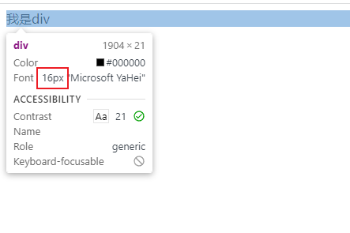
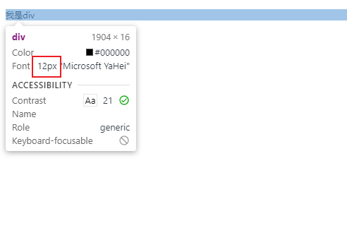
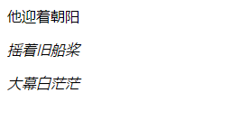
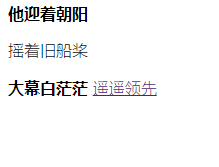
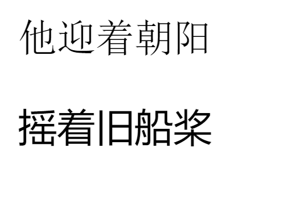

### 字体大小

css当中可以通过`font-size`来设置文本的字体大小

| 值       | 含义                                                         |
| -------- | ------------------------------------------------------------ |
| px       | 像素                                                         |
| em       | 相对于父元素的font-size                                      |
| rem      | 相对于页面根元素html的font-size                              |
| larger   | 相对父元素的larger(比父元素大)                               |
| smaller  | 相对父元素的smaller(比父元素小)                              |
| xx-small | 小小小号字体                                                 |
| x-small  | 小小号字体                                                   |
| small    | 小号字体                                                     |
| medium   | 中号字体                                                     |
| large    | 大号字体                                                     |
| x-large  | 加大号字体                                                   |
| xx-large | 加加大号字体                                                 |
| 百分比   | 是相对于**浏览器默认字体**大小或**继承body设定**的字体大小来说的。 |

> <hr>
>
>
> 注意: 字体默认大小为16px(谷歌浏览器)


###### 字体默认大小



###### 最小字体



> 谷歌浏览器默认最小字体为12px

<hr>


### 字体样式

`font-style`设置字体的样式，如斜体...

| 值      | 说明                                           |
| ------- | ---------------------------------------------- |
| normal  | 默认值，正常                                   |
| italic  | 文本以斜体显示                                 |
| oblique | 文本为“倾斜”（倾斜与斜体非常相似，但支持较少） |



```html
<!DOCTYPE html>
<html lang="en">
    <head>
        <meta charset="UTF-8" />
        <meta name="viewport" content="width=device-width, initial-scale=1.0" />
        <title>Document</title>
        <style>
            div {
                font-style: normal;
            }
            p {
                font-style: italic;
            }
            span {
                font-style: oblique;
            }
        </style>
    </head>
    <body>
        <div>他迎着朝阳</div>
        <p>摇着旧船桨</p>
        <span>大幕白茫茫</span>
    </body>
</html>
```

### 字体粗细

`font-weight`设置字体的粗细

| 值      | 描述                                                        |
| ------- | ----------------------------------------------------------- |
| normal  | 默认                                                        |
| bold    | 定义粗体字符                                                |
| bolder  | 定义更粗的字符                                              |
| lighter | 定义更细的字符                                              |
| 100~900 | 定义由细到粗的字符。400 等同于 normal，而 700 等同于 bold。 |



```html
<!DOCTYPE html>
<html lang="en">
    <head>
        <meta charset="UTF-8" />
        <meta name="viewport" content="width=device-width, initial-scale=1.0" />
        <title>Document</title>
        <style>
            div {
                font-weight: bold;
            }
            p {
                font-weight: lighter;
            }
            span {
                font-weight: 900;
            }
            a {
                font-weight: 100;
            }
        </style>
    </head>
    <body>
        <div>他迎着朝阳</div>
        <p>摇着旧船桨</p>
        <span>大幕白茫茫</span>
        <a href="">遥遥领先</a>
    </body>
</html>
```

### 字体家族

`font-family`指定文本的字体系列

| 值          | 描述                                                |
| ----------- | --------------------------------------------------- |
| family-name | 用于某个元素的字体族名称或/及类族名称的一个优先表。 |



```html
<!DOCTYPE html>
<html lang="en">
    <head>
        <meta charset="UTF-8" />
        <meta name="viewport" content="width=device-width, initial-scale=1.0" />
        <title>Document</title>
        <style>
            div {
                font-family: "Times New Roman", Times, serif;
            }
            p {
                font-family: "Gill Sans", "Gill Sans MT", Calibri, "Trebuchet MS",
                    sans-serif;
            }
        </style>
    </head>
    <body>
        <div>他迎着朝阳</div>
        <p>摇着旧船桨</p>
    </body>
</html>
```

### 文本装饰 text-decoration 

> ##### text-decoration: overline | line-through | underline

实际上text-decoration是 `text-decoration-line`,`text-decoration-color`,`text-decoration-style`三种属性的简写。

##### text-decoration-line 属性规定文本修饰要使用的线条类型。

| none         | 默认值。规定文本修饰没有线条。                               | [测试 »](https://www.runoob.com/try/playit.php?f=playcss_text-decoration-line&preval=none) |
| ------------ | ------------------------------------------------------------ | ------------------------------------------------------------ |
| underline    | 规定文本的下方将显示一条线。                                 | [测试 »](https://www.runoob.com/try/playit.php?f=playcss_text-decoration-line&preval=underline) |
| overline     | 规定文本的上方将显示一条线。                                 | [测试 »](https://www.runoob.com/try/playit.php?f=playcss_text-decoration-line&preval=overline) |
| line-through | 规定文本的中间将显示一条线。                                 | [测试 »](https://www.runoob.com/try/playit.php?f=playcss_text-decoration-line&preval=line-through) |
| initial      | 设置该属性为它的默认值。请参阅 [*initial*](https://www.runoob.com/cssref/css-initial.html)。 | [测试 »](https://www.runoob.com/try/playit.php?f=playcss_text-decoration-line&preval=initial) |
| inherit      | 从父元素继承该属性。请参阅 [*inherit*](https://www.runoob.com/cssref/css-inherit.html)。 |                                                              |

##### text-decoration-color 属性规定文本修饰（下划线 underline、上划线 overline、中划线 line-through）的颜色。

|         |                                                              |                                                              |
| ------- | ------------------------------------------------------------ | ------------------------------------------------------------ |
| *color* | 规定文本修饰的颜色。                                         | [测试 »](https://www.runoob.com/try/playit.php?f=playcss_text-decoration-color&preval=red) |
| initial | 设置该属性为它的默认值。请参阅 [*initial*](https://www.runoob.com/cssref/css-initial.html)。 | [测试 »](https://www.runoob.com/try/playit.php?f=playcss_text-decoration-color&preval=initial) |
| inherit | 从父元素继承该属性。请参阅 [*inherit*](https://www.runoob.com/cssref/css-inherit.html)。 |                                                              |

##### text-decoration-style 属性规定线条如何显示。

|         |                                                              |                                                              |
| ------- | ------------------------------------------------------------ | ------------------------------------------------------------ |
| solid   | 默认值。线条将显示为单线。                                   | [测试 »](https://www.runoob.com/try/playit.php?f=playcss_text-decoration-style&preval=solid) |
| double  | 线条将显示为双线。                                           | [测试 »](https://www.runoob.com/try/playit.php?f=playcss_text-decoration-style&preval=double) |
| dotted  | 线条将显示为点状线。                                         | [测试 »](https://www.runoob.com/try/playit.php?f=playcss_text-decoration-style&preval=dotted) |
| dashed  | 线条将显示为虚线。                                           | [测试 »](https://www.runoob.com/try/playit.php?f=playcss_text-decoration-style&preval=dashed) |
| wavy    | 线条将显示为波浪线。                                         | [测试 »](https://www.runoob.com/try/playit.php?f=playcss_text-decoration-style&preval=wavy) |
| initial | 设置该属性为它的默认值。请参阅 [*initial*](https://www.runoob.com/cssref/css-initial.html)。 | [测试 »](https://www.runoob.com/try/playit.php?f=playcss_text-decoration-style&preval=initial) |
| inherit | 从父元素继承该属性。请参阅 [*inherit*](https://www.runoob.com/cssref/css-inherit.html)。 |                                                              |

##### font样式简写

> font-style  | font-weight | font-size | line-height | font-family

注意:font缩写的时候，必须有font-size和font-family两个值，否则不生效，其他值可省略，有默认值。

line-height（只能在font-size后面以/接上，如果16px/24px，表示字体16px， 24line-height）