### 盒子模型

##### 什么是盒子模型

当对一个文档进行布局（lay out）的时候，浏览器的渲染引擎会根据标准之一的 **CSS 基础框盒模型**（**CSS basic box model**），将所有元素表示为一个个矩形的盒子（box）。CSS 决定这些盒子的大小、位置以及属性（例如颜色、背景、边框尺寸…）。

> 盒子模型由 content(内容) + padding(内边距) + margin(外边距) + border(边框) 组成

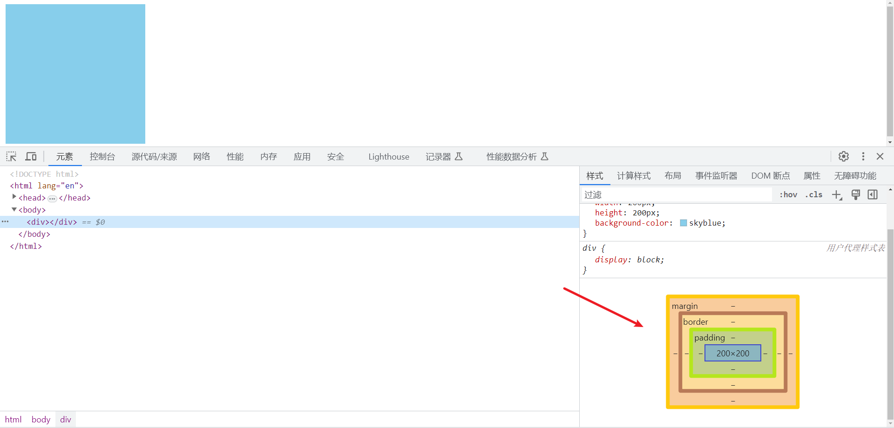

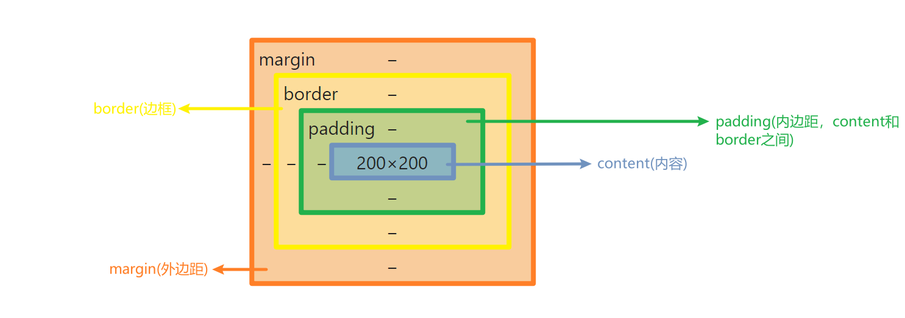

##### 内容区域

> **内容区域**（content area）由内容边界限制，容纳着元素的“真实”内容，例如文本、图像，或是一个视频播放器。它的尺寸为内容宽度（或称 *content-box 宽度*）和内容高度（或称 *content-box 高度*）。它通常含有一个背景颜色（默认颜色为透明）或背景图像。

我们通过width和height设置的元素宽高，就是元素的content大小。

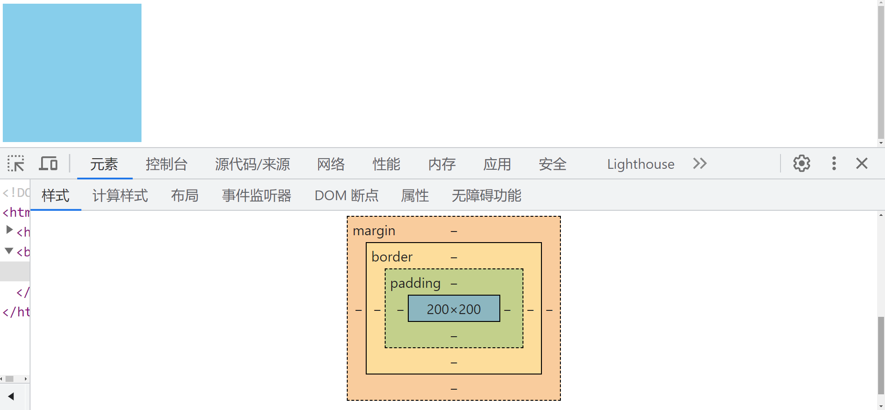

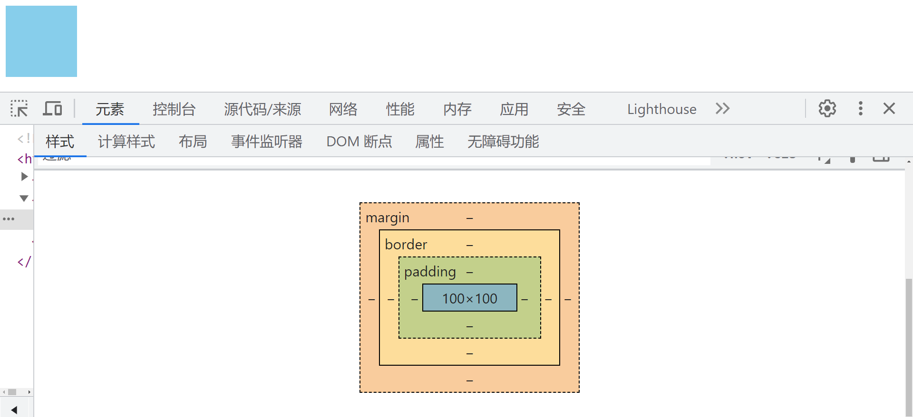

##### 内边距区域

> **内边距区域**（padding area）由内边距边界限制，扩展自内容区域，负责延伸内容区域的背景，填充元素中内容与边框的间距。它的尺寸是 *padding-box 宽度* 和 *padding-box 高度*。

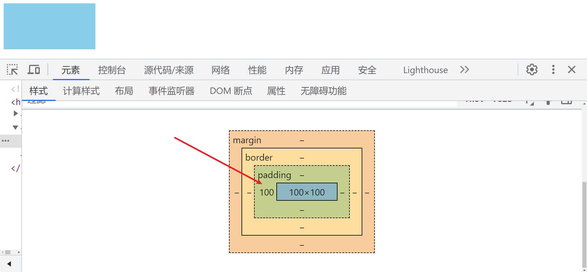

> 我们可以通过`padding-right`,`padding-bottom`,`padding-left`来设置元素的上，右，下，左内边距。
>
> 也可以通过padding直接设置四个方向的内边距

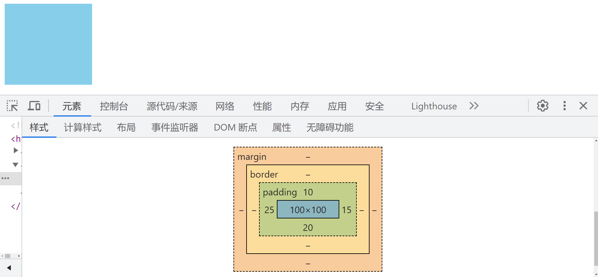

```html
<!DOCTYPE html>
<html lang="en">
    <head>
        <meta charset="UTF-8" />
        <meta name="viewport" content="width=device-width, initial-scale=1.0" />
        <title>Document</title>
    </head>
    <style>
        div {
            width: 100px;
            height: 100px;
            background-color: skyblue;
            padding: 10px 15px 20px 25px; /* 一次性设置四个方向margin */
        }
    </style>
    <body>
        <div></div>
    </body>
</html>
```

##### 边框区域

> **边框区域**（border area）由边框边界限制，扩展自内边距区域，是容纳边框的区域。其尺寸为 *border-box 宽度*和 *border-box 高度*。

我们可以通过`border`来设置元素的四条边框

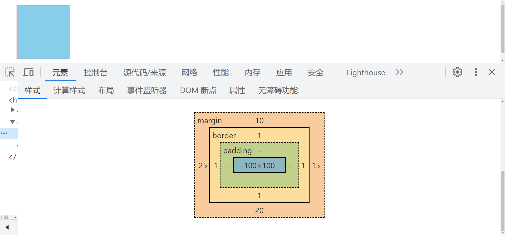

```html
<!DOCTYPE html>
<html lang="en">
    <head>
        <meta charset="UTF-8" />
        <meta name="viewport" content="width=device-width, initial-scale=1.0" />
        <title>Document</title>
    </head>
    <style>
        div {
            width: 100px;
            height: 100px;
            background-color: skyblue;
            margin: 10px 15px 20px 25px;
            border: 1px solid red;  /* 宽度 样式 颜色 */
        }
    </style>
    <body>
        <div></div>
    </body>
</html>
```

##### 外边距区域

> **外边距区域**（margin area）由外边距边界限制，用空白区域扩展边框区域，以分开相邻的元素。它的尺寸为 *margin-box 宽度*和 *margin-box 高度*。

可以通过margin设置四个方向的外边距

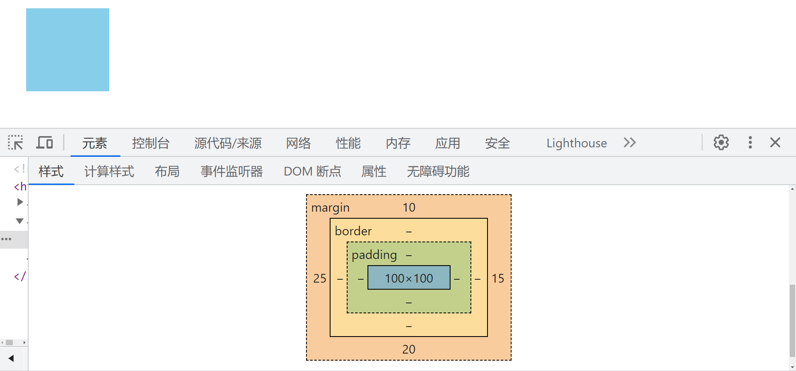

```html
<!DOCTYPE html>
<html lang="en">
    <head>
        <meta charset="UTF-8" />
        <meta name="viewport" content="width=device-width, initial-scale=1.0" />
        <title>Document</title>
    </head>
    <style>
        div {
            width: 100px;
            height: 100px;
            background-color: skyblue;
            margin: 10px 15px 20px 25px;
        }
    </style>
    <body>
        <div></div>
    </body>
</html>
```

在页面当中，我们更多的是用margin来调整元素位置，分开相邻元素 `margin:10px 15px 20px 25px` ，顺序为上右下左；也可以通过`margin-top`,`margin-right`,`margin-bottom`,`margin-left`来分别设置各个方向的外边距

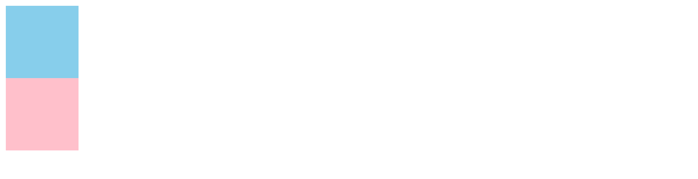

```html
<!DOCTYPE html>
<html lang="en">
    <head>
        <meta charset="UTF-8" />
        <meta name="viewport" content="width=device-width, initial-scale=1.0" />
        <title>Document</title>
    </head>
    <style>
        .one {
            width: 100px;
            height: 100px;
            background-color: skyblue;
        }
        .two {
            width: 100px;
            height: 100px;
            background-color: pink;
        }
    </style>
    <body>
        <div class="one"></div>
        <div class="two"></div>
    </body>
</html>
```

通过margin使得相邻的两个元素分开

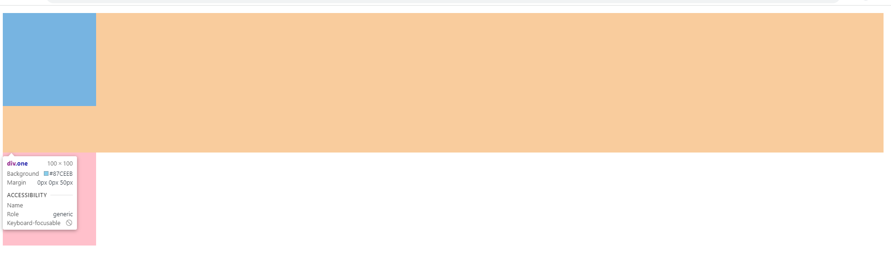

```html
<!DOCTYPE html>
<html lang="en">
    <head>
        <meta charset="UTF-8" />
        <meta name="viewport" content="width=device-width, initial-scale=1.0" />
        <title>Document</title>
    </head>
    <style>
        .one {
            width: 100px;
            height: 100px;
            background-color: skyblue;
            margin-bottom: 50px;
        }
        .two {
            width: 100px;
            height: 100px;
            background-color: pink;
        }
    </style>
    <body>
        <div class="one"></div>
        <div class="two"></div>
    </body>
</html>
```

##### 怪异盒模型

设置`box-sizing:border-box`我们就能使用怪异盒模型

> 怪异盒模型与标准盒模型的区别在于，怪异盒模型 = content(content+padding+border) + margin

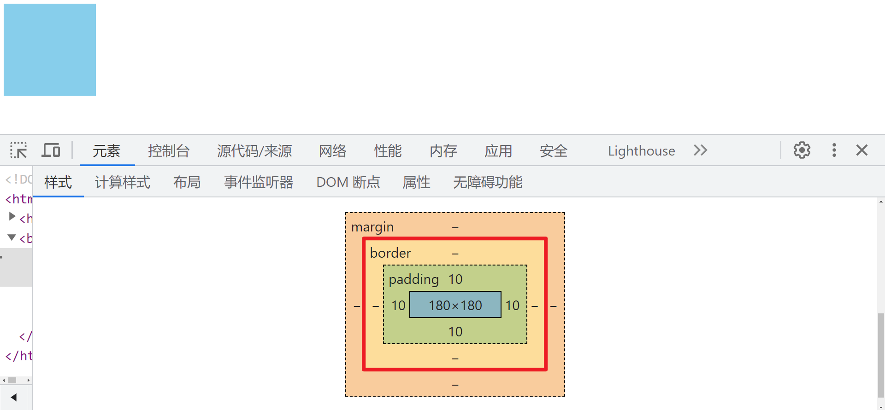

```html
<!DOCTYPE html>
<html lang="en">
    <head>
        <meta charset="UTF-8" />
        <meta name="viewport" content="width=device-width, initial-scale=1.0" />
        <title>Document</title>
    </head>
    <style>
        .one {
            width: 200px;
            height: 200px;
            background-color: skyblue;
            padding: 10px;
            box-sizing: border-box;
        }
    </style>
    <body>
        <div class="one"></div>
    </body>
</html>
```

