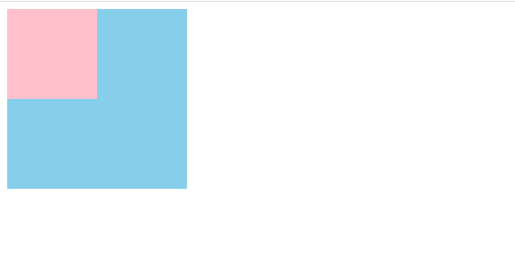

### 定位

布局方式: 文档流，浮动 ，定位等

定位: 是一种布局手段，而且它是一种高级的布局手段，可以将页面中的任何元素放在页面中的任意位置，通过`position`属性进行设置

> 定位的必要条件: 定位模式+边偏移量

#### 定位模式

| 定位模式 | 说明     |
| -------- | -------- |
| static   | 静态定位 |
| relative | 相对定位 |
| absolute | 绝对定位 |
| sticky   | 粘性定位 |
| fixed    | 固定定位 |

#### 边偏移

| 边偏移量 | 说明                                        |
| -------- | ------------------------------------------- |
| top      | 顶端偏移量，即元素距离其父元素上边线的距离  |
| right    | 右侧偏移量， 即元素距离其父元素左边线的距离 |
| bottom   | 底部偏移量， 即元素距离其父元素下边线的距离 |
| left     | 左侧偏移量， 即元素距离其父元素右边线的距离 |


##### 静态定位

static 静态定位(默认)，即没有定位，元素遵循标准流的拜访特性，且没有边偏移。



```html
<!DOCTYPE html>
<html lang="en">
    <head>
        <meta charset="UTF-8" />
        <meta name="viewport" content="width=device-width, initial-scale=1.0" />
        <title>Document</title>
    </head>
    <style>
        .one {
            width: 200px;
            height: 200px;
            background-color: skyblue;
        }
        .two {
            width: 100px;
            height: 100px;
            background-color: pink;
            position: static;   /* 静态定位没有边偏移，并且也不能用于布局 */
        }
    </style>
    <body>
        <div class="one">
            <div class="two"></div>
        </div>
    </body>
</html>
```

**注意：**静态定位没有边偏移，在布局时很少用到。

##### 相对定位

relative 相对定位，是元素在移动位置时，是相对于自身原来位置进行偏移。 

添加定位之前


添加relative定位之后


```html
<!DOCTYPE html>
<html lang="en">
    <head>
        <meta charset="UTF-8" />
        <meta name="viewport" content="width=device-width, initial-scale=1.0" />
        <title>Document</title>
    </head>
    <style>
        .one {
            width: 200px;
            height: 100px;
            background-color: skyblue;
            color: white;
            line-height: 100px;
            text-align: center;
        }
        .two {
            width: 200px;
            height: 100px;
            background-color: pink;
            color: white;
            line-height: 100px;
            text-align: center;
            position: relative;
            left: 200px;
        }
    </style>
    <body>
        <div class="one">div1</div>
        <div class="two">div2</div>
    </body>
</html>
```

**注意:相对定位会保留原来的位置，不会影响其他盒子的位置**

##### 绝对定位

absolute 绝对定位，是元素在移动位置时，相对于它带有定位祖先元素来说的。


同样是left:200px ,和relative的效果不一样。

```html
<!DOCTYPE html>
<html lang="en">
    <head>
        <meta charset="UTF-8" />
        <meta name="viewport" content="width=device-width, initial-scale=1.0" />
        <title>Document</title>
    </head>
    <style>
        .one {
            width: 200px;
            height: 100px;
            background-color: skyblue;
            color: white;
            line-height: 100px;
            text-align: center;
        }
        .two {
            width: 200px;
            height: 100px;
            background-color: pink;
            color: white;
            line-height: 100px;
            text-align: center;
            position: absolute;
            left: 200px;
        }
    </style>
    <body>
        <div class="one">div1</div>
        <div class="two">div2</div>
    </body>
</html>
```

> 1.绝对定位不会保留原来的位置（脱标），那后面盒子就会往上占了它的位置；
>
> 2.如果没有祖先元素或者祖先元素没有定位，则以浏览器为基准定位；
>
> 3.如果祖先元素有定位（可以是相对、绝对或者固定定位），则以最近的已经定位的祖先元素为基准移动位置。 
>
> 4.虽然父元素的定位可以是相对、绝对或者固定定位，但是绝对定位和固定定位都会脱离标准流，所以我们实际开发中，一般都使用相对定位，这就是常说的子绝父相。

##### 固定定位

fixed 固定定位，是元素固定于浏览器可视区的位置。主要特点为： 在浏览器页面滚动时元素的位置不会改变。


```html
<!DOCTYPE html>
<html lang="en">
    <head>
        <meta charset="UTF-8" />
        <meta name="viewport" content="width=device-width, initial-scale=1.0" />
        <title>Document</title>
    </head>
    <style>
        .one {
            width: 200px;
            height: 100px;
            background-color: skyblue;
            color: white;
            line-height: 100px;
            text-align: center;
        }
        .two {
            width: 200px;
            height: 100px;
            background-color: pink;
            color: white;
            line-height: 100px;
            text-align: center;
            position: fixed;
            left: 200px;
        }
        body {
            height: 1200px;
        }
    </style>
    <body>
        <div class="one">div1</div>
        <div class="two">div2</div>
    </body>
</html>
```

> 1.**固定定位**是**相对浏览器窗口来定位**的 ，与父元素没有关系；
>
>  2.偏移量**不会随滚动条的移动而移动**；
>
>  3.脱离文档流，**不再占有原来位置**，是浮起来的。