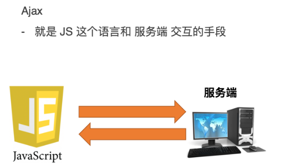

### 一.ajax是什么

Ajax(Asynchronous JavaScript and XML)是一种**异步**的前后端进行交互的技术,可以**不用刷新**整个页面，就可以达到局部更新的效果。



使用 `ajax` 请求数据时，被请求的 `URL` 地址，就叫做 数据接口（简称**接口**）

***URL组成***


### 二.ajax的使用

##### 2.1 特点

- 在 js 中有内置的构造函数来创建 ajax 对象
- 创建 ajax 对象以后，我们就使⽤ ajax 对象的⽅法去发送请求和接受响应
- ajax的一个最大的特点是`无需刷新页面便可向服务器传输或读写数据`

##### 2.2 使用步骤

- 1.创建一个ajax对象

  ```javascript
  let xhr = new XMLHttpRequest();
  ```

- 2.调用xhr对象的open()函数，创建一个ajax请求

  ```javascript
  xhr.open("请求方式","请求地址");
  // xhr.open("get","https://myajax.usemock.com/shop_list");
  ```

- 3.设置请求头

  ```javascript
  xhr.setRequestHeader(
      "Content-Type",
      "application/x-www-form-urlencoded"
  );
  //固定写法,get请求可以不用请求头，其余的必须加上请求头
  ```

- 4.调佣xhr对象的send()函数，发送请求

  ```javascript
  xhr.send();
  //如果需要传递参数，那么在括号传递参数
  ```

- 5.监听xhr对象的onreadystatechange事件
  `当请求被发送到服务器时，我们需要执行一些基于响应的任务。每当 readyState 改变时，就会触发 onreadystatechange 事件。`

  | 属性       | 描述                                                         |
  | ---------- | ------------------------------------------------------------ |
  | readyState | 存有 XMLHttpRequest 的状态。从 0 到 4 发生变化。<br />0:请求未初始化<br />1:服务器连接已建立<br />2:请求已接收<br />3:请求处理中<br />4:请求已完成 |
  | status     | 请求状态码。<br />200:表示ok<br />404:资源未找到             |

  ```javascript
  xhr.onreadystatechange = function() {
      if(xhr.readyState === 4 && xhr.status === 200) {
          //如果能进入到这个if当中，说明服务器接收到我们的请求，并且已经正常处理完毕
          console.log("请求成功",xhr.response)
          //服务器会把数据给到前端，存在xhr对象的response属性当中
      }
  }
  ```

常见状态码:

- 200 (成功)：服务器已成功处理请求。一般这表示服务器正常处理了请求，并且正常返回了相应的页面
- 400 (错误请求)：表示客户端请求的语法错误，服务器无法理解,前端参数的问题,参数传递错误
- 401 (未经授权，需要身份验证)：token=>没有权限,token过期
- 403（禁止）：服务器理解请求客户端的请求，拒绝请求
- 404 (未找到)：服务器无法根据客户端请求找到资源
- 405（方法禁用）：禁用请求中指定的方法
- 500（服务器内部错误）：服务器遇到一个未预料到的状况，导致无法完成对请求的处理
- 502（错误网关）：服务器作为网关或者代理，从上游服务器收到无效响应
- 503（服务不可用）：服务器目前无法使用。例如：超载、停机维护…
- 504（网关超时）：服务器作为网关或代理，但未及时收到上游服务器的响应

### 三.ajax请求方式

##### 3.0.1 常用请求方法和数据提交

| 请求方法 | 操作           |
| -------- | -------------- |
| GET      | 获取数据       |
| POST     | 数据提交       |
| PUT      | 修改数据(全部) |
| PATCH    | 修改数据(部分) |
| DELETE   | 删除数据       |

##### 3.1 get请求

> get请求一般使用在希望从服务器获取数据的情况。

###### 3.1.1 使用ajax发起不带参数的get请求

```javascript
// 1.创建XHR对象
var xhr = new XMLHttpRequest();
//  2.调用open函数
xhr.open('GET', '请求的URL地址');
// 3.调用send函数
xhr.send()
// 4.监听 onreadystatechange 事件
xhr.onreadystatechange = function () {
    // 判断条件是固定的代码   这里的status和获取看到的Status Code不一样
    if (xhr.readyState === 4 && xhr.status === 200) {
        // 获取服务器响应的数据   
        console.log(xhr.response)
    }
}
```

###### 3.1.2 使用ajax发起带参数的get请求

```javascript
// 1.创建
var xhr = new XMLHttpRequest();
//  2. open   地址后面跟的是携带的参数
xhr.open('GET', '发送请求的URL地址?id=1&name=张三',);
//  3. send()
xhr.send();
// 4. onreadystatechange
xhr.onreadystatechange = function () {
    // 判断成功 信息
    if (xhr.readyState === 4 && xhr.status === 200) {
        console.log(xhr.responseText)
    }
}
```

##### 3.2 post请求

> post请求一般使用在希望向服务器提交数据的情况。

###### 3.2.1 使用ajax发送post请求

```javascript
// 1. 创建 xhr 对象
var xhr = new XMLHttpRequest()
// 2. 调用 open 函数
xhr.open('POST', '请求的URL地址')
// 3. 设置 Content-Type 属性
xhr.setRequestHeader('Content-Type', 'application/x-www-form-urlencoded')
// 4. 调用 send 函数
xhr.send('bookname=水浒传&author=施耐庵&publisher=上海图书出版社')
// 5. 监听事件
xhr.onreadystatechange = function () {
    if (xhr.readyState === 4 && xhr.status === 200) {
        console.log(xhr.responseText)
    }
}
```


